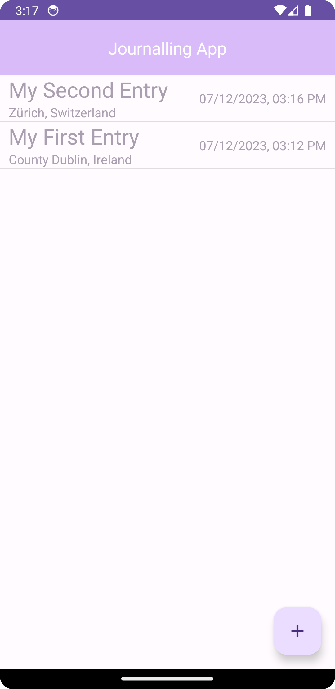
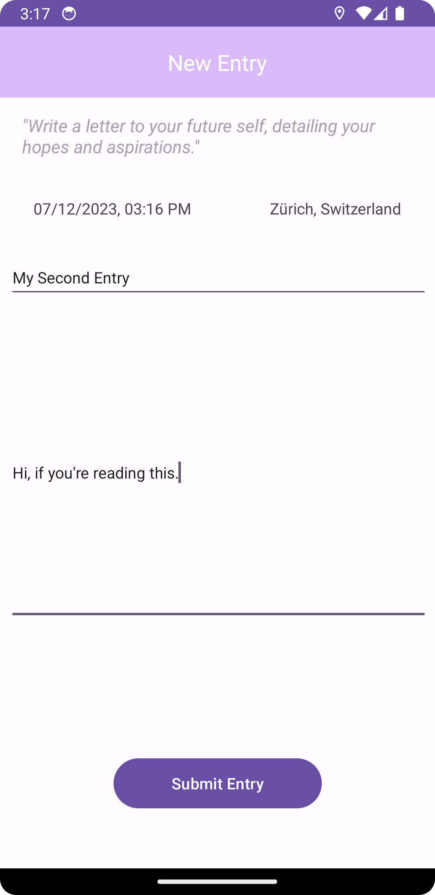
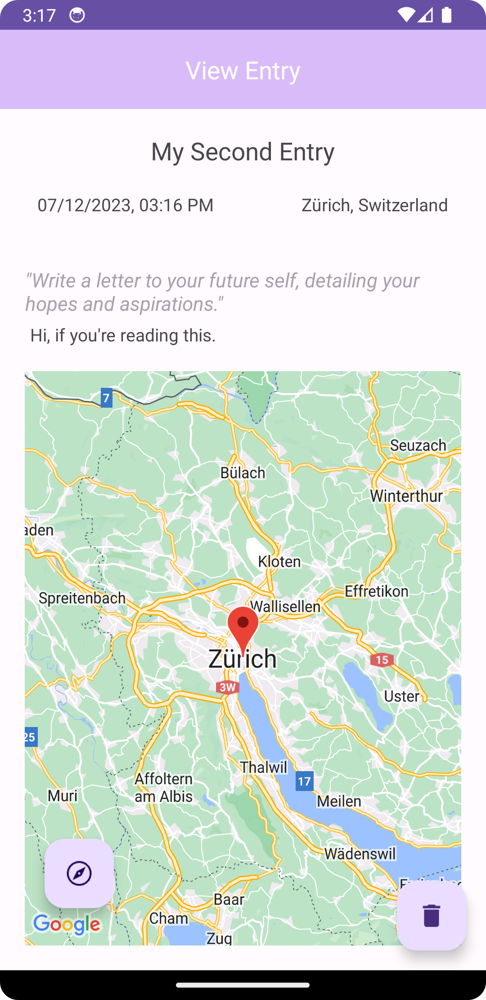
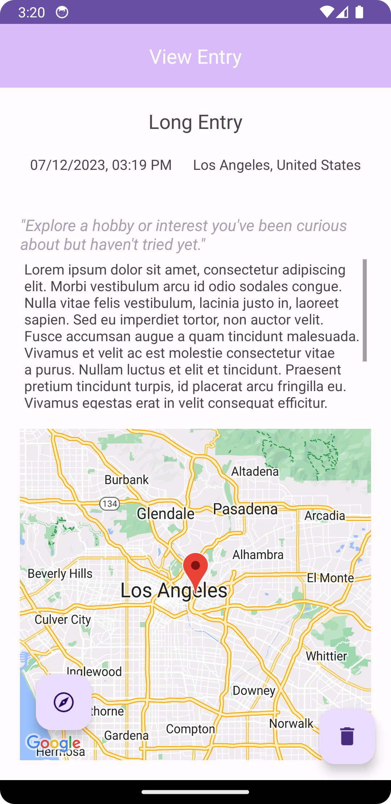
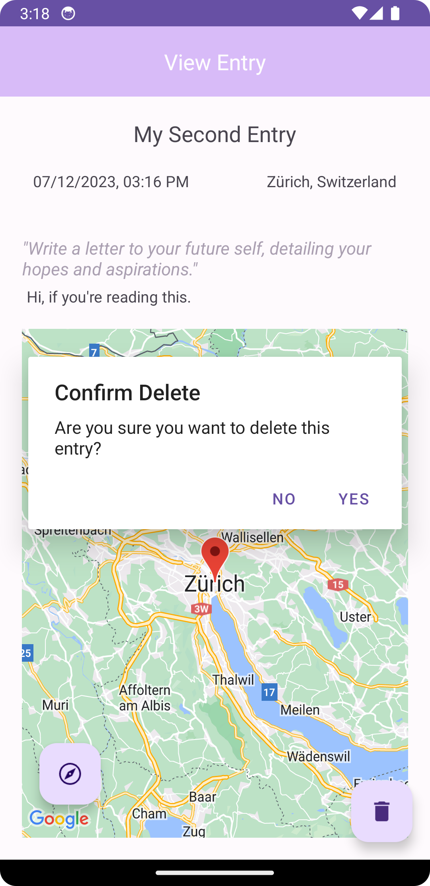

# Journalling App
An Android journalling app written in Java.
The app has the following functionality:
- Allows the user to write journal entries, logging the time and location at the time of writing. 
    The user is shown a random journalling prompt to help them come up with ideas.
- View a list of previously written entries, ordered by date 
- View previously written entries individually, along with a Google Maps fragment showing the location of writing

The app implements three activities: 
1. MainActivity

This is where the user can view all of their previously written journal entries. Entries are shown in chronological order. Upon clicking on an entry, ViewEntryActivity is launched, showing them more details about that entry. Otherwise, they can click on the plus button in the bottom right to add a new entry using NewEntryActivity.

2. NewEntryActivity

This is where the user writes a new entry. The app takes note of the system time and location and adds it to the entry for future reference. The user is then asked to give their entry a title, and write the entry. The user is shown a random journalling prompt chosen from an array of prompts. If all details have been entered and the user's location was found, the entry is added to the database. Otherwise, the app shows an appropriate error message.

3. ViewEntryActivity
  
This activity is used for the user to view previously written entries. The user is shown the title they gave their entry, along with the date and location of writing (in text). The user is shown the same journalling prompt given to them initially, along with their journal entry. A Google Map fragment is used to show the user their exact location at the time of writing. The Map fragment is fully interactive, and features a compass button to return the Map to the original marker.
The TextView where the entry contents is shown has a maximum height, so the Google Map fragment does not get too small. Should the TextView hit this maximum height, it will become scrollable. 
Lastly, the Activity features a delete button on the bottom right. The user will be asked to confirm the deletion. If they choose to continue, the entry will be removed from the database.
